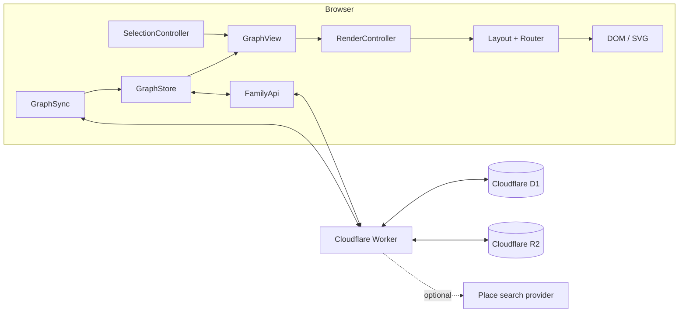
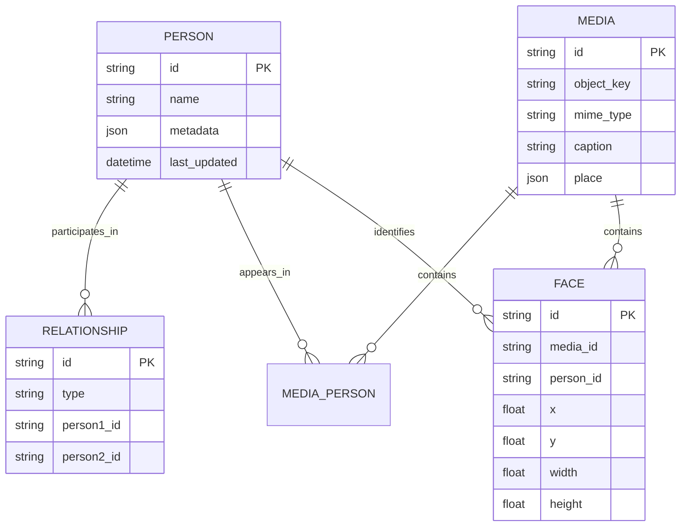

# Family Graph

A lightweight, person-centric genealogy application built around a simple idea:

> **Store one relationship graph. Render the tree that matters from the person you are looking at.**

Instead of treating a family tree as a fixed diagram, Family Graph stores people and relationships as the durable source of truth. Selecting any person produces a fresh, contextual projection around them — ancestry, descendants, partners, siblings, and nearby branches — with layout and emphasis generated on demand.

The result is a family history tool that feels more like navigating a living graph than scrolling through a static chart.

[Installation →](INSTALL.md)

---

## Why a graph?

Traditional genealogy interfaces tend to make the drawing itself feel canonical. Family Graph separates **data** from **view**:

```text
People ↔ Relationships
          ↓
   selected person
          ↓
 contextual projection
          ↓
 generation layout
          ↓
 routed family graph
```

The database answers **who is related to whom**.

The browser decides **which part of that graph is useful right now**.

Re-rooting on another person does not load another saved tree. It recomputes a new view over the same underlying relationships.

## Experience

Family Graph is designed to stay visually calm even as the underlying genealogy becomes large.

- **Person-centric navigation** — search for a person or select any visible card to make them the new root.
- **Context-aware projection** — direct ancestry and descendants remain prominent while collateral branches stay lighter or collapsed until needed.
- **Inline editing** — add or edit people, parents, partners, children, dates, places, notes, and life metadata directly from the graph.
- **Relationship-aware families** — parent relationships and partner unions are represented explicitly rather than inferred from a saved drawing.
- **Responsive layout** — the same graph model adapts to desktop and touch-first mobile interaction.
- **Automatic routing** — spouses, parents, children, sibling groups, and multi-partner families are arranged by generation with orthogonal, crossing-aware connectors.
- **Photos and portraits** — images are stored as media, can be associated with people, tagged with face regions, and used as primary portraits.
- **Import / export** — the complete relationship graph can be exported as readable JSON and restored transactionally.
- **Resilient startup** — the browser keeps a persistent graph snapshot so a previously loaded tree can render even when the server is temporarily unavailable.
- **Cross-device synchronization** — a lightweight graph revision mechanism detects remote changes and refreshes the local view.

## Architecture

The project intentionally avoids a large frontend framework or separate application server.



### Browser

The frontend is vanilla JavaScript, organized by ownership rather than framework conventions:

- `SelectionController` owns the selected person and URL/browser persistence.
- `GraphStore` owns the canonical browser graph, indexes, revisions, and persistent cache.
- `GraphView` turns the global relationship graph into the visible person-centric projection.
- `RenderController` owns one coherent geometry/render generation.
- Layout refinements and `planar-router` arrange family units and produce SVG connectors.
- `FamilyApi` is the browser transport boundary.
- `GraphSync` reconciles revisions from other clients without making the UI depend on every network read.

The visible graph is disposable. The relationship graph is not.

### Server

A Cloudflare Worker serves both the frontend and API:

- **Cloudflare D1** stores people, relationships, graph revision state, media metadata, face regions, and cached place results.
- **Cloudflare R2** stores original image bytes.
- **Cloudflare static assets** serve the browser application.
- **D1 migrations** own schema creation and evolution; normal HTTP request paths do not perform schema setup.

## Data model

At the center of the application are two concepts:



Relationship semantics are deliberately small:

- `parent` — `person1_id` is the parent and `person2_id` is the child.
- `spouse` — a symmetric partner/union edge with normalized endpoints.

The editor protects important graph invariants: explicit parentage is bounded, co-parents are never guessed, and family unions are created explicitly when required by the relationship model.

Media is separate from genealogy. An image can be associated with multiple people, and face rectangles are normalized to the original image so they remain valid at any rendered size.

## Projection and layout

The renderer is intentionally asymmetric because genealogies grow very differently vertically and sideways.

| Relationship to the selected person | Default treatment |
| --- | --- |
| Selected person | Primary focus |
| Ancestors | Eager / recursive |
| Descendants | Eager / recursive |
| Partners | Visible with the selected family context |
| Siblings | Visible context |
| Partner ancestry | Limited contextual depth |
| Collateral branches | Collapsed until requested |
| Expanded branches | Temporary view state |

Layout is generated from the visible projection, then refined in stages. The engine keeps partners on the same generation, parent/child relationships one generation apart, sibling groups coherent, and connector routes away from cards where possible.

The final drawing is a combination of DOM cards and SVG connectors sharing the same canvas coordinate system.

## Photos and face identity

Photos are first-class family data rather than decoration attached directly to cards.

Original image bytes live in R2; D1 keeps their metadata and associations. A photo can belong to several people, individual faces can be marked and assigned, and a preferred face can become the portrait shown on a person card.

This separation keeps the core relationship graph compact while allowing a richer visual archive to grow independently.

## Reliability and synchronization

Family Graph is designed so a transient backend problem does not automatically become an empty screen.

The browser persists the latest valid graph snapshot and can render it immediately on startup. Server revisions are reconciled separately, and cache-covered network failures are surfaced in the developer console rather than silently hiding the failure.

Structural edits still use the server as the authoritative persistence boundary; the cache is a resilience mechanism, not a competing source of truth.

## Repository map

```text
.
├── public/                 Browser application
│   ├── family-api.js       HTTP transport
│   ├── graph-store.js      Canonical browser graph + cache
│   ├── graph-view.js       Person-centric projection
│   ├── render-controller.js
│   ├── family-mutations.js
│   ├── planar-*.js         Layout and connector routing
│   ├── person-*.js         Person editing and metadata
│   ├── *media*.js          Photo experience
│   └── face-*.js           Face tagging and portraits
├── src/                    Cloudflare Worker API
│   ├── entry.js            Request routing / asset entry
│   ├── worker.js           Graph and person API
│   ├── media.js            R2 media API
│   ├── faces.js            Face identity API
│   ├── places.js           Optional place search
│   └── graph-invariants.js
├── migrations/             Canonical D1 schema migrations
├── tests/                  Behavioral and invariant tests
├── setup.sh                First-time D1 setup
├── deploy.sh               Migrate + deploy current revision
├── wrangler.toml           Cloudflare bindings and route config
└── INSTALL.md              Installation and deployment guide
```

## Development

The project favors small, explicit ownership boundaries over abstraction for its own sake. Rendering, graph state, transport, mutations, media, and server persistence each have a clear owner, while the runtime remains plain JavaScript that can be inspected directly in the browser.

Run the test suite with:

```bash
npm test
```

For local setup, Cloudflare resources, migrations, configuration, and deployment, see **[INSTALL.md](INSTALL.md)**.

## API at a glance

The Worker exposes a compact HTTP API around the graph and its supporting data, including:

- graph read/write and revision endpoints
- person/node updates
- media upload and metadata
- media/person associations
- face regions and preferred portraits
- optional place search
- deployed build/version metadata

`GET /api/graph` returns the canonical `family-graph` document used by the browser and import/export flow.

## Security

The application does not provide an application-level authentication system. A deployment containing private family information should be protected at the hosting/access layer before real data is added.

## License

ISC.
