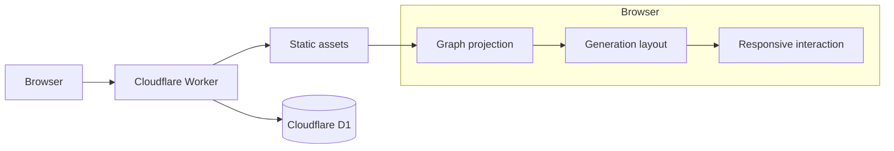
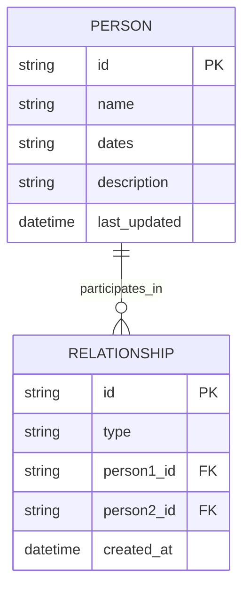

# Family Graph

A person-centric family tree built as a **single global relationship graph** rather than a collection of saved trees.

Choose any person and the UI dynamically renders the family around them: direct ancestry and descendants stay prominent, lateral context stays light, and less-relevant branches remain collapsed until requested.

**Live:** [family.barnahum.com](https://family.barnahum.com)

---

## What makes it different

Most family-tree applications start with a saved tree and navigate inside it. This project starts with people and relationships:

```text
People ←→ Relationships
```

A visible tree is only a projection:

```text
selected person
      +
relationship graph
      +
visibility rules
      ↓
visible subgraph
      ↓
generation-aware layout
```

There is no permanent “view” to maintain. Selecting a different person simply regenerates the family around that person.

## Highlights

- **Person-centric navigation** — search for anyone or tap/click a card to make that person the new center.
- **One global graph** — people and parent/spouse relationships are stored independently of the current view.
- **Vertical genealogy is eager** — the selected person’s ancestry and descendants are rendered naturally.
- **Horizontal genealogy is lazy** — siblings and collateral branches are contextual or collapsed behind `+N` controls.
- **Spouse ancestry stays contextual** — only one spouse-ancestry level is shown by default.
- **Ephemeral expansion** — `+N` branches reset on reload; only the selected anchor person is persisted in the browser.
- **Responsive mobile UI** — touch-first selection, centered root person, compact context cards, and a full expanded selected card.
- **Inline editing** — names, dates, descriptions, parents, spouses, children, and deletion are editable directly in the graph.
- **Human-readable import/export** — the complete graph can be exported and restored as JSON.
- **Generation-aware layout** — spouses stay on the same generation, children stay one generation below parents, and sibling groups remain coherent.
- **Soft orthogonal connectors** — family lines use rounded knees rather than hard 90° corners.
- **Build visibility** — every deployed page exposes the current Git SHA/build information.

## Architecture



The application intentionally stays lightweight:

- **Cloudflare Workers** for the application/API origin
- **Cloudflare D1** for persistent family data
- **Cloudflare static assets** for the frontend
- **Vanilla JavaScript** for graph projection and layout
- **Tailwind CSS** for the base UI
- No client framework and no separate application server

## Data model

The conceptual model is deliberately simple:



Relationship semantics:

- `parent`: `person1_id` is the parent and `person2_id` is the child.
- `spouse`: symmetric; endpoints are normalized so the same couple is not stored twice in reverse order.

The current database still retains the original `nodes` representation as a compatibility layer while `relationships` is the first-class graph representation. This keeps older CRUD behavior working during the migration to a fully relationship-native editor.

### Graph API format

`GET /api/graph` returns the complete family graph:

```json
{
  "format": "family-graph",
  "version": 2,
  "people": [
    {
      "id": "person_1",
      "name": "Example Person",
      "dates": "1950–2024",
      "description": "Short family note",
      "lastUpdated": "2026-01-01T00:00:00Z"
    }
  ],
  "relationships": [
    {
      "id": "parent:person_1:person_2",
      "type": "parent",
      "person1Id": "person_1",
      "person2Id": "person_2"
    }
  ]
}
```

`PUT /api/graph` replaces the global graph transactionally after validation.

Legacy `/api/tree` and `/api/nodes` endpoints remain available for compatibility with the current editing controls.

## View rules

The renderer is intentionally asymmetric. Family history is usually sparse going backward but can become extremely wide sideways.

| Direction | Default behavior |
| --- | --- |
| Selected person | Fully emphasized |
| Ancestors | Eager / recursive |
| Descendants | Eager / recursive |
| Selected person’s spouse | Visible |
| Spouse ancestry | One level by default |
| Siblings | Visible, de-emphasized |
| Sibling families / collateral branches | Lazy, behind `+N` |
| Expanded branches | Temporary until reload or re-root |

Clicking or tapping any person re-roots the graph and clears temporary branch expansion.

## Desktop interaction

Unselected cards behave as clean name tiles. On hover/focus they expand visually to expose dates, description, edit controls, and the **center here** affordance without changing their measured outer geometry.

The selected person gets a strong visual highlight and remains fully readable/editable.

Mouse drag-panning is intentionally disabled; trackpad, wheel, and scrollbars provide canvas navigation without fighting card selection.

## Mobile interaction

Mobile uses the same graph and layout model with a touch-specific presentation:

- Tap any unselected card to center the family on that person.
- The selected person expands into a full card with all editable content and controls.
- Unselected cards remain compact name tiles.
- The selected card is recentered after initial load, re-rooting, rotation, and responsive relayout.
- Touch-sized relationship controls surround the selected card.
- `+N` frontier controls remain outside the card and are independently tappable.
- Safe-area insets and iOS input behavior are handled explicitly.

## Layout invariants

The layout engine tries to preserve a few hard rules before optimizing aesthetics:

1. Married partners occupy the same generation.
2. A child is exactly one generation below its parent family unit.
3. Spouses remain a fixed visual distance apart.
4. Cards in the same generation do not overlap.
5. Sibling blocks are kept together when ordering generations.
6. Parent/child trunks are made vertical where possible without breaking ordering or overlap constraints.
7. Connector routing stays inside the empty space between generations.

The final connector rendering uses straight vertical/horizontal segments with a small rounded radius at orthogonal knees.

## Repository layout

```text
.
├── deploy.sh
├── package.json
├── schema.sql
├── setup.sh
├── wrangler.toml
├── src/
│   └── worker.js
└── public/
    ├── index.html
    ├── graph-view.js
    ├── layout-refinement.js
    ├── node-hover.js
    ├── import-export.js
    ├── interaction-refinement.js
    ├── mobile-refinement.js
    └── presentation-refinement.js
```

### Frontend layers

The frontend is intentionally split into small progressive refinement files:

- `index.html` — base cards, CRUD, layout engine, SVG connectors
- `layout-refinement.js` — post-layout straightening and family-unit alignment
- `node-hover.js` — hover/default-text behavior
- `graph-view.js` — person-centric graph projection, search, root selection, `+N` expansion
- `import-export.js` — graph JSON import/export and anchor persistence
- `interaction-refinement.js` — selection area, drag-pan suppression, contextual styling
- `mobile-refinement.js` — touch interaction and compact mobile geometry
- `presentation-refinement.js` — shared card presentation and mobile recentering

The Worker injects these scripts with the deployed build SHA so frontend changes are cache-busted automatically.

## Running locally

Install dependencies:

```bash
npm install
```

For a clean local D1 database:

```bash
npx wrangler d1 execute family_tree_db --local --file=./schema.sql
```

Then run the Worker locally:

```bash
npx wrangler dev
```

> `schema.sql` is appropriate for creating a clean local database. Do not blindly re-run destructive setup steps against an existing production database.

## Deployment

Deployment is intentionally simple:

```bash
git pull
./deploy.sh
```

`deploy.sh` injects the current Git SHA and deployment timestamp into the Worker build before running Wrangler.

The production custom domain is version-controlled in `wrangler.toml`:

```toml
[[routes]]
pattern = "family.barnahum.com"
custom_domain = true
```

Cloudflare handles the custom-domain routing and TLS certificate.

## API surface

| Method | Endpoint | Purpose |
| --- | --- | --- |
| `GET` | `/api/graph` | Read the complete global graph |
| `PUT` | `/api/graph` | Replace/import the complete global graph |
| `GET` | `/api/version` | Current deployed build metadata |
| `GET/PUT` | `/api/tree` | Legacy tree compatibility |
| CRUD | `/api/nodes` | Legacy/current inline editor compatibility |

## Import / export

The title card exposes JSON import/export controls. Exports use the `family-graph` v2 envelope and are intended to be readable, diffable, and easy to back up.

The importer also accepts the older `family-tree` v1 format and translates it through the compatibility layer.

## Current limitations / next steps

The graph storage already supports multiple relationship records, but parts of the editing UI still expose the older single-parent / single-spouse interaction model.

Likely next steps:

- relationship-native editing with search/autocomplete for existing people
- explicit multiple-parent and multiple-spouse UI
- multiple-marriage layout units
- richer relationship metadata such as biological/adoptive/step relationships and marriage status/dates
- person photos/media with originals in object storage and crop metadata in D1

## Design principle

The database should answer **who is related to whom**.

The UI should answer **what part of that graph matters from where I am standing right now**.

That separation is the core of the project.
